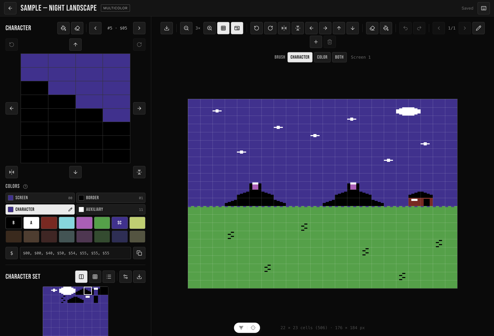

VIC-EDITOR
==========

A browser-based character set and screen editor for the [Commodore VIC-20](https://en.wikipedia.org/wiki/VIC-20)
and its MOS 6560/6561 ("VIC-I") video chip. Draw a character set, paint screens
with it, and export code that assembles, loads or runs on the machine.

**[Open the editor →](https://acwright.github.io/VIC-EDITOR/)** — or run it as a
native app for macOS, Windows and Linux, see **[Desktop](#desktop)**.



Everything runs client-side. There is no account, no server and no upload:
projects live in your browser's `localStorage`, download as `.vic20.json`, and
share as a single self-contained link.

## What it does

- **Character editor.** Draw 8×8, 8×16 hires or 4×8, 4×16 multicolor cells on a
  pixel grid sized to the shape the chip actually reads. Fill, clear, invert,
  wrapping shifts in four directions, horizontal and vertical flips, and
  rotation — every one of them undoable.
- **Character set.** 64, 128 or 256 characters, shown as scaled blocks, as a
  scrolling grid that fills the width with 8, 16 or 32 a row, or as a list with
  each character's code and whether its slot is still blank — whichever suits
  the window, remembered per browser, and starting in the grid on a phone. New
  projects seed from the VIC-20 ROM font rather than from nothing.
- **Screen editor.** Paint characters and color RAM onto a 22 × 23 screen at
  1×–8× zoom, resize it to anything the chip can show, and keep as many named
  screens in a project as you like. The brush writes the character, its color
  RAM value, or both, so a recolor pass leaves the drawing underneath alone; the
  right button erases whichever of those layers the brush covers.
- **The VIC's own color model.** 16 fixed colors, a per-cell color RAM value,
  and the screen, border and auxiliary registers the whole project shares —
  with the two 3-bit fields refusing colors 8–15, as the hardware does. Changing
  a global color repaints every surface at once.
- **Authentic preview.** The screen draws pixels the shape a VIC pixel really
  has — about half again as wide as it is tall — so it looks like what the
  machine will show. One toolbar toggle (`A`) squares it back off to the grid
  the bytes describe.
- **Register-level settings.** Screen geometry against the 512-cell color RAM
  budget, character height and set size, the global colors, NTSC or PAL, and the
  memory layout — expansion, character base and screen base, with the color RAM
  address the latter forces. Under it all sits a live `$9000`–`$900F` readout:
  sixteen bytes in hex, each explaining its fields on hover, copyable as an
  addressed dump.
- **Export.** 6502 assembly in three dialects, BASIC `DATA` with a generated
  loader, `.prg`, raw binary, or PNG. See [Export](#export).
- **Keyboard and touch.** One keyboard map drives the whole editor, the pixel
  grid, the character set and the screen each take focus and paint under a
  cursor, and on a phone or tablet the two columns become two tabs with both
  canvases painting under a finger.

Four sample projects — a title screen, a night landscape, a dungeon and a
wide-screen layout — are one click from the project list if you would rather
start from something than from a blank grid.

## The chip

### Colors

The VIC has no transparent color; every pixel resolves to one of these sixteen.

| #   | Name         | Hex       | Character | Border | Screen | Auxiliary |
| --- | ------------ | --------- | :-------: | :----: | :----: | :-------: |
| 0   | Black        | `#000000` |    ✅     |   ✅   |   ✅   |    ✅     |
| 1   | White        | `#FFFFFF` |    ✅     |   ✅   |   ✅   |    ✅     |
| 2   | Red          | `#782922` |    ✅     |   ✅   |   ✅   |    ✅     |
| 3   | Cyan         | `#87D6DD` |    ✅     |   ✅   |   ✅   |    ✅     |
| 4   | Purple       | `#AA5FB6` |    ✅     |   ✅   |   ✅   |    ✅     |
| 5   | Green        | `#55A049` |    ✅     |   ✅   |   ✅   |    ✅     |
| 6   | Blue         | `#40318D` |    ✅     |   ✅   |   ✅   |    ✅     |
| 7   | Yellow       | `#BFCE72` |    ✅     |   ✅   |   ✅   |    ✅     |
| 8   | Orange       | `#AA7449` |    ❌     |   ❌   |   ✅   |    ✅     |
| 9   | Light Orange | `#EAB489` |    ❌     |   ❌   |   ✅   |    ✅     |
| 10  | Light Red    | `#B86962` |    ❌     |   ❌   |   ✅   |    ✅     |
| 11  | Light Cyan   | `#C7FFFF` |    ❌     |   ❌   |   ✅   |    ✅     |
| 12  | Light Purple | `#EA9FF6` |    ❌     |   ❌   |   ✅   |    ✅     |
| 13  | Light Green  | `#94E089` |    ❌     |   ❌   |   ✅   |    ✅     |
| 14  | Light Blue   | `#8080FF` |    ❌     |   ❌   |   ✅   |    ✅     |
| 15  | Light Yellow | `#FFFFC0` |    ❌     |   ❌   |   ✅   |    ✅     |

Character color and border color are **3-bit** fields — colors 0–7 only. Screen
(background) and auxiliary are **4-bit** — all sixteen. The color picker knows
which slot it is filling and disables 8–15 when it has to, so an impossible
color is never a thing you can pick and then discover later.

### Cell modes

Which of the two a cell uses is bit 3 of its color RAM value. This editor makes
that a property of the _character_, not of the cell it sits in, so a glyph looks
the same everywhere it appears; wanting one glyph both ways means duplicating it.

**Hires** — 8 pixels wide, 8 or 16 tall, 1 bit per pixel:

| Bit | Color                             |
| --- | --------------------------------- |
| `0` | Screen color (`$900F` bits 4–7)   |
| `1` | This cell's color RAM value (0–7) |

**Multicolor** — 4 pixels wide, each double-width so the cell still occupies 8
screen pixels, 8 or 16 tall, 2 bits per pixel:

| Bits | Color                               |
| ---- | ----------------------------------- |
| `00` | Screen color (`$900F` bits 4–7)     |
| `01` | **Border** color (`$900F` bits 0–2) |
| `10` | This cell's color RAM value (0–7)   |
| `11` | Auxiliary color (`$900E` bits 4–7)  |

That `01` is the VIC's signature quirk: the border color does double duty as a
fill color, so changing the border recolors every multicolor cell on the screen.
The editor shows it live rather than making you find out on the machine.

**Reverse** (`$900F` bit 3) globally swaps 0 and 1 in hires cells; multicolor
cells are unaffected. Note the polarity — the bit is _set_ for normal display
and _clear_ for reverse.

A project picks one of three types up front: **hires** and **multicolor** lock
every cell to one form, and **mixed** lets each character choose, which is what
real VIC screens do.

### Screen geometry

Screen size is registers, not a fixed grid:

| Field       | Register         | Range              | Default |
| ----------- | ---------------- | ------------------ | ------- |
| Columns     | `$9002` bits 0–6 | 1–31 in the editor | 22      |
| Rows        | `$9003` bits 1–6 | 1–32 in the editor | 23      |
| Char height | `$9003` bit 0    | 0 = 8×8, 1 = 8×16  | 8×8     |

**The hard limit is 512 cells**, because color RAM is 512 nybbles. The default
22 × 23 = 506 sits just under it, and the settings dialog shows the budget as
you change either field. The column and row caps above are the editor's own,
chosen conservatively: what a real 6560 displays past about 31 columns depends
on timing and on the model, and the registers themselves will take larger values
than anything that resolves into a picture.

Columns and rows are project-wide, so changing them re-fits every screen at
once — confirmed first when it would crop something, and undoable either way.

## VIC-20 memory notes

This is where people get stuck, so it is worth reading before the first export.

**Where things live depends on what expansion is fitted.** Adding RAM moves
BASIC's start, which moves the screen, which moves color RAM:

| Expansion        | BASIC start | Screen  | Color RAM | Typical charset  |
| ---------------- | ----------- | ------- | --------- | ---------------- |
| Unexpanded (5 K) | `$1001`     | `$1E00` | `$9600`   | `$1C00` (val 15) |
| +3 K             | `$0401`     | `$1E00` | `$9600`   | `$1C00` (val 15) |
| +8 K and above   | `$1201`     | `$1000` | `$9400`   | `$1400` (val 13) |

The editor's expansion setting offers that conventional layout rather than
moving your memory around behind your back — you can still put the screen and
the charset wherever you like.

**Color RAM is not freely placeable.** It sits at `$9400` or `$9600`, and which
one you get is decided by `$9002` bit 7 — the same bit that is video-matrix A9.
Move the screen base across a 512-byte boundary and color RAM follows. The
settings dialog shows the address the current screen base forces.

**The character base is 1 KB granular** — `$9005` bits 0–3 select one of sixteen
1 KB blocks:

| Value | Address                      | Value | Address |
| ----- | ---------------------------- | ----- | ------- |
| 0     | `$8000` (uppercase ROM)      | 8     | `$0000` |
| 1     | `$8400` (uppercase reversed) | 9     | `$0400` |
| 2     | `$8800` (lowercase ROM)      | 10    | `$0800` |
| 3     | `$8C00` (lowercase reversed) | 11    | `$0C00` |
| 4     | `$9000`                      | 12    | `$1000` |
| 5     | `$9400`                      | 13    | `$1400` |
| 6     | `$9800`                      | 14    | `$1800` |
| 7     | `$9C00`                      | 15    | `$1C00` |

Values 0–3 are the ROM font, which is why a custom set has to go somewhere in
8–15. That granularity is also why the set sizes are 64, 128 or 256 characters —
512 B, 1 KB or 2 KB at 8×8, and double that at 8×16.

**Leave room for it yourself.** On an unexpanded VIC, `$1C00` is inside the
memory BASIC will happily use, so a program has to lower the top of BASIC before
it pokes a character set there. The generated loader does _not_ do this — it
writes each segment to its address and nothing else — so a 2 KB set at `$1C00`
means reserving that memory first. On +8 K and above there is room at `$1400`
without moving anything.

**NTSC and PAL** differ in the default screen origins, in how many rows fit, and
in pixel aspect ratio. The project setting drives all three.

## Export

Pick a scope — the **charset** or a **screen** — then the segments you want and
a format. Segments are these:

| Segment         | Contents                                                       |
| --------------- | -------------------------------------------------------------- |
| `char_patterns` | `charCount × charHeight` bytes, MSB leftmost                   |
| `screen_N`      | Character codes for screen N, row-major, `columns × rows`      |
| `colors_N`      | Color RAM for screen N: color in bits 0–2, multicolor in bit 3 |
| `vic_registers` | The sixteen bytes of `$9000`–`$900F`                           |

And the formats:

| Format       | Extension          | Notes                                                                                 |
| ------------ | ------------------ | ------------------------------------------------------------------------------------- |
| **Assembly** | `.s` / `.a`/`.asm` | ca65 / 64tass (`.byte`), ACME (`!byte`) or DASM (`dc.b`). Label case is configurable. |
| **BASIC**    | `.bas`             | BASIC 2.0 `DATA` lines packed to ≤ 80 characters, with a start line and step you set. |
| **PRG**      | `.prg`             | The bytes behind a 2-byte little-endian load address, taken from the first segment.   |
| **Binary**   | `.bin`             | The same bytes with no header at all.                                                 |
| **PNG**      | `.png`             | The character set as a sheet, or a screen, at 1×–8×.                                  |

The BASIC export can generate a **loader** ahead of the data: one
`FOR`/`READ`/`POKE` loop per segment, each writing to the address that segment
belongs at — so selecting `vic_registers` sets up the chip, `char_patterns`
lands at the configured character base, and a screen and its color RAM go into
the video matrix and `$9400`/`$9600`. It is the fastest route from this editor
to something running on a real machine or in VICE.

Because a `.prg` is one contiguous block starting at one address, selecting a
screen and its color RAM together produces a file that loads at the video matrix
and runs past the end of it. When the pieces belong at addresses that are not
adjacent, use the BASIC loader instead.

## Projects and sharing

Projects autosave to `localStorage` under `vic20-editor:*` keys. From the project
list you can rename, duplicate, delete, download one as `.vic20.json`, upload one
back, or copy a share link — which packs the whole project into the link's `#v=`
hash, so no server ever sees it and anyone who opens it gets an editable copy of
their own. Undo history is per session and travels with neither.

## Desktop

The same editor as a native app for macOS, Windows and Linux. Download it from the
[latest release](https://github.com/acwright/VIC-EDITOR/releases/latest):

| Platform | File | Notes |
| --- | --- | --- |
| macOS (Apple silicon) | `vic20-editor-<version>-mac-arm64.dmg` | Signed and notarized — opens without a Gatekeeper prompt |
| Windows (x64) | `vic20-editor-<version>-win-x64.exe` | NSIS installer. Unsigned, so SmartScreen warns on first run — *More info → Run anyway* |
| Linux (x64) | `vic20-editor-<version>-linux-x86_64.AppImage` | `chmod +x`, then run it |
| Linux (x64) | `vic20-editor-<version>-linux-amd64.deb` | `sudo apt install ./vic20-editor-<version>-linux-amd64.deb` |

Everything the web app does, the desktop app does — it is one renderer behind two
shells, not a port. What it adds:

- **A real menu bar**, with the keyboard map as accelerators. Menu items follow
  the open project: a hires project greys out the multicolor-only items, and the
  project list greys everything but *New project*.
- **Native save and open dialogs.** Every export — assembly, BASIC, binary, PNG,
  project JSON — goes through the system save sheet, so you choose the folder and
  the filename instead of fishing the file out of `~/Downloads`. Each kind of
  export remembers the directory you last used. Importing a project opens a real
  file panel.
- **Its own storage.** Projects live in the app's own `userData` directory rather
  than in a browser profile, so clearing browsing data cannot touch them, and they
  are flushed to disk on the way out — an edit made a moment before you quit is
  there on relaunch.
- **A window that remembers itself**, including which display it was on and
  whether it was maximized.
- **No network at all.** The web app is already client-side; the desktop app has
  no browser, no address bar and no tab.

The desktop app's projects are **separate** from the web app's — different storage,
no sync. Move one across with *Download* and *Upload* in the project list, or a
share link.

### Building the desktop app from source

`npm run build` is the Electron build (it bundles main, preload and renderer to
`out/`); `npm run build:web` is the one that produces the Pages site. Packaging
each platform is a separate command, and each has a prerequisite:

```sh
npm run icons        # regenerate build/icon.{icns,ico,png} from the master PNG
npm run pack         # unpacked app in dist/mac-arm64 — no signing, quickest check
npm run dist:mac     # → dist/*.dmg      requires a Developer ID cert + notarization credentials
npm run dist:win     # → dist/*.exe      requires Wine (brew install --cask wine-stable)
npm run dist:linux   # → dist/*.AppImage, *.deb   requires Docker running
npm run dist         # all three, in that order
```

- **macOS** signs, notarizes and staples. It needs a *Developer ID Application*
  certificate in the keychain and `APPLE_ID`, `APPLE_APP_SPECIFIC_PASSWORD` and
  `APPLE_TEAM_ID` in the environment. Without them, use `npm run pack` — it skips
  signing entirely.
- **Windows** builds the NSIS installer under Wine. The installer *runs* only on
  real Windows: its script calls PowerShell's `Get-CimInstance`, which Wine stubs
  out.
- **Linux** builds in a container, so nothing has to be installed on the host but
  Docker.

If `npm run dev` or `npm run preview` dies with *"The requested module 'electron'
does not provide an export named 'BrowserWindow'"*, the shell has
`ELECTRON_RUN_AS_NODE=1` set — some editors' integrated terminals do — which makes
the Electron binary run as plain Node. Run it as
`env -u ELECTRON_RUN_AS_NODE npm run dev`.

## Getting started

```sh
npm install
npm run dev
```

| Script                            | Does                                   |
| --------------------------------- | -------------------------------------- |
| `npm run dev`                     | The desktop app, with hot reload       |
| `npm run dev:web`                 | Vite dev server (the browser app)      |
| `npm run build`                   | The Electron bundle → `out/`           |
| `npm run build:web`               | The standalone web app → `dist/web/`   |
| `npm run test:unit`               | Vitest                                 |
| `npm run type-check`              | `vue-tsc`                              |
| `npm run lint`                    | oxlint + ESLint                        |
| `npm run format`                  | Prettier over `src/`                   |
| `node scripts/generate-icons.mjs` | Regenerate the icon set in `public/`   |

Vue 3 + TypeScript + Pinia + Vue Router + Tailwind, built with Vite and tested
with Vitest, wrapped in Electron for the desktop builds.

Pushing to `main` runs [deploy.yml](.github/workflows/deploy.yml), which lints,
tests, builds and deploys to GitHub Pages; it passes `VITE_BASE` so the bundle
resolves under `/VIC-EDITOR/`. [ci.yml](.github/workflows/ci.yml) runs the same
gates on a pull request. Both also run `electron-vite build`, so a change that
breaks the main or preload process fails in CI rather than at the next release —
but neither *packages* the desktop app, since a signed, notarized dmg needs a
macOS runner and Apple credentials. Those artifacts are built locally, with the
commands under [Desktop](#building-the-desktop-app-from-source).

See [CLAUDE.md](CLAUDE.md) for the source layout and the decisions behind it, and
[ELECTRON-PLAN.md](ELECTRON-PLAN.md) for the measurements they rest on.

## Layout

```
src/renderer/     the editor — the whole web app, and all the desktop app draws
  src/domain/       pure logic — no Vue (types, charOps, screenOps, export, serialization)
  src/persistence/  localStorage repository and preferences
  src/stores/       Pinia stores (projects, editor + undo history)
  src/components/   base/ + editor/ + projects/ components
  src/samples/      the four bundled sample projects
  src/views/        project manager and editor views
  src/utils/        including the desktop/browser forks (download, upload, platform)
src/main/         the Electron main process — window, menu, native dialogs
src/preload/      the contextBridge API, and nothing else crosses
src/shared/       the types and channel names main and renderer agree on
rom/              VIC-20 character ROM dump, build-time input only
scripts/          charset and icon generators, the Electron binary installer
build/            icons, entitlements, and the icon generator that feeds them
```

The renderer imports nothing from `src/main/`, and reaches the desktop only
through `window.api` — so the same tree builds for the browser, where that object
is simply absent.

## Keyboard

Every key below is also listed in the app: the **Keyboard Shortcuts** button in
either header — or `?` — opens the same map, taken from the same source as this
table. On Apple platforms `Ctrl/Cmd` is `⌘`, `Alt` is `⌥` and `Shift` is `⇧`.

The character grid, the character set and the screen each take focus and answer
to a cursor: arrows move it, `Enter` paints, `Backspace` clears, and the cell
under it is announced for a screen reader.

### Project

| Key                | Action                   |
| ------------------ | ------------------------ |
| `Ctrl/Cmd+Z`       | Undo                     |
| `Shift+Ctrl/Cmd+Z` | Redo                     |
| `Ctrl/Cmd+S`       | Save now                 |
| `?`                | Keyboard shortcuts       |
| `Esc`              | Back to the project list |
| `Esc`              | Close the document       |

In the desktop app `Esc` closes the open document and returns to the start screen; in the browser
it returns to the project list.

### Character

| Key       | Action                  |
| --------- | ----------------------- |
| `[`       | Previous character      |
| `]`       | Next character          |
| `F`       | Fill the character      |
| `C`       | Clear the character     |
| `I`       | Invert the character    |
| `H`       | Flip horizontal         |
| `V`       | Flip vertical           |
| `R`       | Rotate right            |
| `Shift+R` | Rotate left             |
| `Alt+←`   | Shift the pattern left  |
| `Alt+→`   | Shift the pattern right |
| `Alt+↑`   | Shift the pattern up    |
| `Alt+↓`   | Shift the pattern down  |

### Color

| Key | Action                     |
| --- | -------------------------- |
| `4` | Target the screen color    |
| `5` | Target the border color    |
| `6` | Target the character color |
| `7` | Target the auxiliary color |

### Screen

| Key       | Action                   |
| --------- | ------------------------ |
| `1`       | Brush: character         |
| `2`       | Brush: color             |
| `3`       | Brush: both              |
| `,`       | Previous screen          |
| `.`       | Next screen              |
| `+` / `=` | Zoom in                  |
| `-`       | Zoom out                 |
| `G`       | Grid overlay             |
| `A`       | Aspect-corrected preview |

### Canvas cursor

| Key                    | Action                                                 |
| ---------------------- | ------------------------------------------------------ |
| `Tab`                  | Focus the pixel grid, the character set, or the screen |
| `←` / `→` / `↑` / `↓`  | Move the cursor                                        |
| `Home` / `End`         | First or last cell of the row                          |
| `Enter` / `Space`      | Paint the cursor cell                                  |
| `Backspace` / `Delete` | Erase the cursor cell                                  |
| `Esc`                  | Hide the cursor                                        |

### Project list

| Key | Action             |
| --- | ------------------ |
| `N` | New project        |
| `?` | Keyboard shortcuts |

## License and attribution

The editor's own source is MIT — see [LICENSE](LICENSE). Two pieces of data in
the repository come from elsewhere and are worth naming.

**The palette.** The sixteen hex values above are VICE's default `vic20`
palette, from the [VICE](https://vice-emu.sourceforge.io/) project. They are a
rendering choice rather than hardware truth — real output varies by TV and by
chip revision — and they live in one table (`src/domain/palette.ts`) so they can
be swapped for another set.

**The character ROM.** New projects seed from the VIC-20 character generator ROM,
revision 901460-03. `rom/chargen.bin` is a dump of that ROM, and
`src/domain/romCharset.ts` is generated from it by `scripts/generate-charset.mjs`.
This is Commodore's data, not this project's: it is **not** covered by the MIT
license above, and no license to it is granted or implied here. It is included
on the same widely-accepted footing as the ROM sets that ship with VICE and other
emulators, for compatibility with a machine discontinued in 1985. If that is not
a basis you are comfortable with, seeding a project from `blank` skips the font
entirely, and deleting `rom/chargen.bin` plus regenerating leaves nothing of it
in the build.
